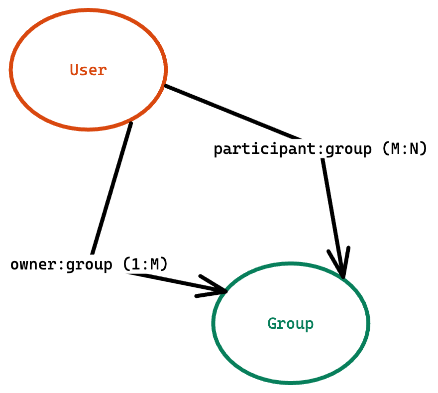

# Relations

[Drawing](https://excalidraw.com/#json=VkNwSpKqWfQC7W5tAtZn0,XwY7ROsIc1_POfRftILG0w)

## Types:

## One-to-many (1:M) or Many-to-one

### User Model (users):
- _id
- name: String
- email: String
- password: String
- image: String
- createdAt: Date
- updatedAt: Date

### Post Model (posts):
- _id
- title: String
- content: String
<!-- - authorId: String (User._id) -->
- author: { userId: String, name: String, image: String  }
- createdAt: Date
- updatedAt: Date

### Comment Model (comments):
- _id
- comment: String
  <!-- De-normalized Approach -->
- user: { userId: String, name: String, image: String  }
  <!-- Normalized Approach -->
- postId: String
- createdAt: Date
- updatedAt: Date

## One-to-One

# Many-to-many

